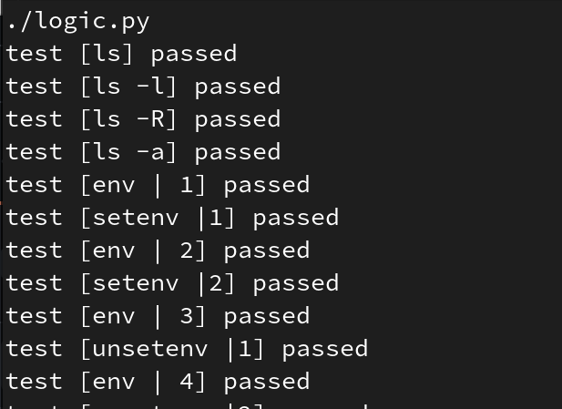

# Minishell-Testing {EPITECH}

# Description
Python script that executes commands in your minishell and in the tcsh shell to compare them.

# Requirements
-> python3

# How to use
1. add you mysh exe to the folder
2. run the "make" command

# Preview

# How to add tests
In order to add tests you'll have to modify the "tests" file.
The structure of each test is the following -> "test_name"={cmd to be executed}
-> Do not write more than one empty line at the end of the file <-
